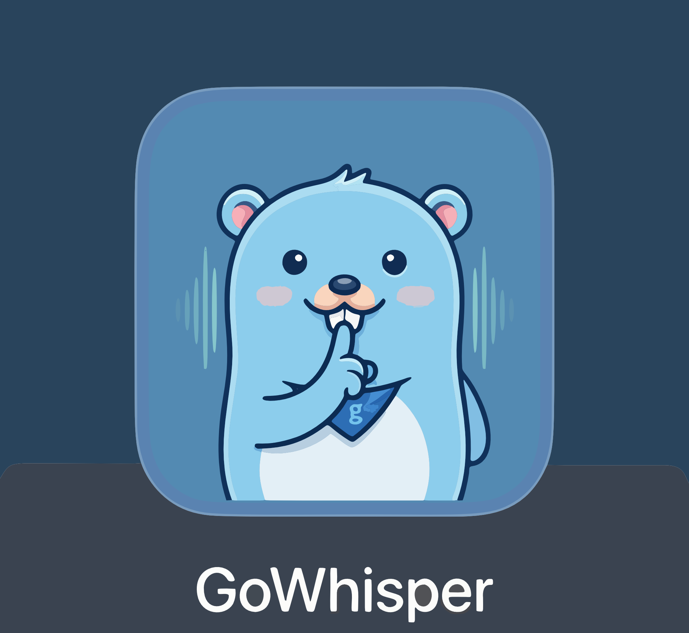

# GoWhisper

<p align="center">
  
</p>

A Superwhisper-inspired voice dictation and translation app for macOS, built in Go. Press a hotkey, speak, press it again — your words are transcribed and pasted into whatever app you're using. Runs fully locally with no cloud dependency.

## Features

- **Toggle recording** — press ⌥Space to start, press again to stop and paste
- **Cancel recording** — press Esc to discard mid-recording, nothing is pasted
- **Cycle modes** — press ⌥⇧K to switch between Standard, Translate, and custom modes
- **ES → EN translation** — Whisper's native translation, no LLM needed
- **LLM post-processing** — optional cleanup via Claude API or a local Ollama model (no API key needed)
- **Custom modes** — define your own prompts in `config.yaml`, cycle through them with a hotkey or pick from the tray menu
- **Model management from the tray** — switch between tiny/small/medium directly from the menu; download models you don't have with live progress; the active model hot-swaps without a restart
- **Startup update check** — on launch GoWhisper silently checks Hugging Face for newer model files; if an update is found the tray shows `Models ●` and a notification appears
- **Transcription history** — every transcription is saved to a local SQLite database; browse with `gowhisper history`
- **Hot-reloadable config** — change hotkeys or models without restarting
- **No cloud, no subscription** — everything runs on your machine

## Stack

| Component | Technology |
|---|---|
| Language | Go |
| Speech-to-text | [whisper.cpp](https://github.com/ggerganov/whisper.cpp) (Metal GPU accelerated) |
| Audio capture | [malgo](https://github.com/gen2brain/malgo) (miniaudio — no Homebrew required) |
| Global hotkeys | [golang.design/x/hotkey](https://pkg.go.dev/golang.design/x/hotkey) |
| Clipboard | CGo + NSPasteboard (AppKit) + CGEventPost |
| Menubar icon | [fyne.io/systray](https://github.com/fyne-io/systray) |
| LLM post-processing | Claude API or local Ollama — both via `net/http`, both optional |
| Native macOS UI | [DarwinKit](https://github.com/progrium/darwinkit) (Phase 9) |
| Config | `config.yaml` with live file watching |

## Hotkeys (default)

| Action | Shortcut |
|---|---|
| Toggle recording | ⌥Space |
| Cancel recording | Esc |
| Cycle mode | ⌥⇧K |

All hotkeys are configurable in `config.yaml`.

## Requirements

- **Apple Silicon Mac** (M1 or later) — Metal GPU acceleration is required; Intel Macs are not supported
- macOS 13.0+
- [Xcode Command Line Tools](https://developer.apple.com/xcode/resources/) — `xcode-select --install`
- [cmake](https://cmake.org) — `brew install cmake`
- Claude API key (optional, for cloud LLM cleanup — set `ANTHROPIC_API_KEY` or add to `config.yaml`)
- [Ollama](https://ollama.com) (optional, alternative to Claude — local cleanup with no API key or internet)

## Downloading a release

Pre-built binaries are available on the [Releases](../../releases) page.

> **Gatekeeper warning:** because the app is not signed with an Apple developer certificate, macOS will block it on first launch. To open it: right-click `GoWhisper.app` → **Open** → **Open** in the dialog. You only need to do this once.

## Getting Started

### 1. Clone with submodules

```bash
git clone --recurse-submodules https://github.com/erdiegoant/go-whisper.git
cd go-whisper
```

### 2. Build whisper.cpp

```bash
make whisper
```

Compiles whisper.cpp into static libraries inside `third_party/whisper.cpp/build/`. Only needed once (or after updating the submodule).

### 3. Download a model

```bash
make download-model
```

Downloads `ggml-small.bin` (~465MB) to `~/.config/gowhisper/models/`. Recommended for a good balance of speed and accuracy with Spanish and English.

| Model | Size | Notes |
|---|---|---|
| tiny | ~75MB | Fastest, lower accuracy |
| small | ~465MB | Recommended |
| medium | ~1.5GB | Most accurate, slower |

You can also download or switch models at any time from the **Models** submenu in the tray icon — no restart required.

### 4. Run

```bash
# Development (faster — no compile step)
make dev

# Or build a binary and run it
make run
```

On first launch, macOS will prompt for:
- **Microphone access** — required to capture your voice
- **Accessibility access** — required for global hotkeys and simulated paste (System Settings → Privacy & Security → Accessibility)

> **Note:** When using `make dev`, mic access is granted to your terminal app, not the binary. If recording captures only silence, open System Settings → Privacy & Security → Microphone and ensure your terminal is listed and enabled. Use `make rectest` to verify mic access before running the full app.

The app lives in your menubar. You'll see `⚫ Standard` when idle.

## Usage

1. Press **⌥Space** — icon changes to `🔴 Standard`, recording starts
2. Speak
3. Press **⌥Space** again — icon changes to `⏳ Standard`, transcription runs
4. Text is pasted into whatever window was active — icon returns to `⚫ Standard`

> **Memory:** after 60 seconds of idle the model is unloaded from RAM. The next press briefly shows `⌛ Standard` while it reloads (~1–3 s depending on model size), then recording starts normally. Change the timeout with `model_unload_timeout_seconds` in config, or set it to `0` to keep the model loaded permanently.

Press **Esc** at any point while recording to cancel (nothing is pasted).

## Configuration

Config lives at `~/.config/gowhisper/config.yaml` (created automatically on first launch):

```yaml
model: small
language: auto
models_dir: "~/.config/gowhisper/models"
max_recording_seconds: 120
model_unload_timeout_seconds: 60  # unload model from RAM after 60s idle; 0 = never unload

# LLM cleanup — pick one backend or omit both to disable cleanup entirely.
# If both are set, Ollama takes priority.

# Option A: Claude API (cloud, requires API key)
claude:
  api_key: ""             # leave empty to use ANTHROPIC_API_KEY env var
  model: "claude-haiku-4-5-20251001"
  timeout_seconds: 15

# Option B: Ollama (local, no API key required)
# ollama:
#   model: "llama3.2:3b"           # any model you have pulled locally
#   host: "http://localhost:11434" # optional, this is the default
#   timeout_seconds: 30

hotkeys:
  toggle_recording: "option+space"
  cancel_recording: "esc"
  change_mode: "option+shift+k"

# Custom modes — omit this block to use the built-in Standard + Translate defaults.
# modes:
#   - name: Standard
#     language: auto       # let Whisper detect the language automatically
#     translate: false
#
#   - name: ES → EN        # speak in Spanish, get English output
#     language: es         # tell Whisper to expect Spanish input
#     translate: true      # use Whisper's native translation (no LLM required)
#
#   - name: Formal
#     language: auto
#     translate: false
#     prompt: "Rewrite this transcript in a formal professional tone. Preserve all technical terms. Return only the result."
#
#   - name: Bullets
#     language: auto
#     translate: false
#     prompt: "Convert this dictation into a concise bullet point list. Return only the result."
```

### Using Ollama for local cleanup

[Ollama](https://ollama.com) lets you run LLMs locally on your Mac with no API key, no internet connection after setup, and Metal GPU acceleration on Apple Silicon.

**1. Install Ollama**

Download and install from [ollama.com/download](https://ollama.com/download), or via Homebrew:

```bash
brew install ollama
```

**2. Pull a model**

```bash
ollama pull llama3.2:3b    # ~2GB — recommended, fast and good quality
ollama pull phi4-mini      # ~2.5GB — fast, good quality
ollama pull mistral:7b     # ~4GB — better quality, slower
```

Browse all available models at [ollama.com/library](https://ollama.com/library).

**3. Add to `~/.config/gowhisper/config.yaml`**

```yaml
ollama:
  model: "llama3.2:3b"   # must match the name you pulled
```

Ollama must be running in the background when GoWhisper is used (`ollama serve`, or it starts automatically if the Ollama menu bar app is installed). If it isn't running, GoWhisper falls back to the raw transcript silently.

All changes are applied live on save — no restart required.

## Makefile Targets

```bash
make whisper          # Build whisper.cpp static libraries (once)
make build            # Compile the Go binary into GoWhisper.app
make run              # Build and run the compiled binary
make dev              # Run directly with go run (faster for development)
make test             # Run all tests
make install          # Install GoWhisper.app to /Applications
make download-model   # Download ggml-small.bin to ~/.config/gowhisper/models/
make rectest          # Record 5s to /tmp/rectest.wav — diagnose mic access (DEV="name" to pick device)
make clean            # Remove build artifacts
```

## Project Structure

```
cmd/gowhisper/        # Main entry point and event loop
cmd/rectest/          # Standalone mic recording test (5s WAV capture)
internal/
  audio/              # Mic capture, recording state machine, device selection
  chunk/              # Audio chunk buffering helpers
  clipboard/          # NSPasteboard save/restore + Cmd+V simulation via CGo
  config/             # Config loading, file watcher, hotkey parsing, state persistence
  history/            # Transcription history — SQLite storage and retrieval
  hotkey/             # Global hotkeys (toggle always-on, Esc only while recording)
  llm/                # LLM transcript cleanup — Claude API and Ollama backends
  mode/               # Mode definitions and manager (name, language, translate, prompt)
  models/             # Whisper model download, update checking, status
  notify/             # macOS notification helpers
  sound/              # Start/stop audio feedback sounds
  transcribe/         # Whisper.cpp integration, TranscribeRequest
  ui/                 # Menubar tray icon, device submenu, model and history menus
assets/               # App icon (.icns) and logo image
third_party/
  whisper.cpp/        # whisper.cpp source (git submodule)
GoWhisper.app/        # macOS app bundle (Info.plist + binary + icon)
phases/               # Development plan (phase-by-phase)
```

## Development Status

| Phase | Description | Status |
|---|---|---|
| 1 | Audio capture | ✅ Done |
| 2 | Whisper.cpp integration | ✅ Done |
| 3 | Hotkey & clipboard | ✅ Done |
| 4 | Translation flow | ✅ Done |
| 5 | Config & shortcuts | ✅ Done |
| 6 | LLM transcript cleanup (Claude API) | ✅ Done |
| 7 | Custom modes | ✅ Done |
| 8 | Polish & reliability | ✅ Done |
| 9 | Native macOS UI (SwiftUI) | ⏸ Postponed |
| 10 | Local LLM backend (Ollama) | ✅ Done |
| 11 | Optional extras (history ✅, transcribe from file ⏳) | 🔄 In progress |

## License

MIT
